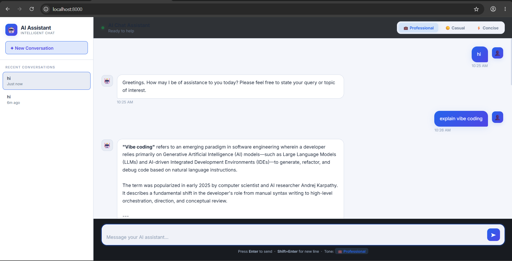

# 🤖 AI Chat Assistant

> An intelligent, real-time chat interface with streaming responses, conversation history, and tone control — built for the Quantiphi Vibe Coding Round.

---

## 📸 Screenshots

> Add screenshots of your running app here.



<!-- To add your own screenshot:
  1. Press Win+Shift+S to take a screenshot
  2. Save it as screenshot.png in the project root
  3. git add screenshot.png && git commit -m "docs: add screenshot" && git push
-->

## 🚀 Live Demo

Run locally at `http://localhost:8000` after setup.

---

## ✨ Features

| Feature | Description |
|---|---|
| 💬 **Chat Interface** | Scrollable conversation view with distinct bubbles for user and AI |
| ⚡ **Streaming View** | Text appears character-by-character in real-time via Server-Sent Events |
| 📁 **History Sidebar** | All past conversation threads listed and retrievable |
| 🎛️ **Tone Toggle** | Switch between Professional, Casual, and Concise AI response styles |
| 🗄️ **MongoDB Persistence** | Stores conversation objects with timestamps, user prompts, and AI responses |
| 🔌 **AI API Integration** | Connects to Gemini AI with streaming support |

---

## 🏗️ Architecture

```
ai-chat-assistant/
├── server.py              # Backend — FastAPI server (all business logic)
│   ├── /api/chat          # POST — streams AI response via SSE
│   ├── /api/history       # GET  — returns all past conversations
│   ├── /api/conversation  # GET/POST — manage conversation threads
│   └── MongoDB integration with in-memory fallback
├── public/
│   └── index.html         # Frontend — chat UI, sidebar, tone toggle
├── .env.example           # Environment variable template
├── .gitignore
└── README.md
```

> **Architecture principle:** All business logic (AI API calls, tone modifiers, DB persistence) is handled server-side. The frontend handles only presentation and user interaction.

---

## 🎛️ The Tone Toggle (Vibe Check)

The tone preference is passed as a **system instruction** to the AI model:

| Tone | System Instruction |
|---|---|
| 💼 Professional | Formal, structured, precise language |
| ☀️ Casual | Conversational, warm, relaxed tone |
| ⚡ Concise | Under 3 sentences, direct and to the point |

---

## 🛠️ Tech Stack

| Layer | Technology |
|---|---|
| **Backend** | Python + FastAPI |
| **AI** | Google Gemini API (streaming) |
| **Database** | MongoDB Atlas (pymongo) |
| **Frontend** | Vanilla HTML + CSS + JavaScript |
| **Streaming** | Server-Sent Events (SSE) |

---

## ⚙️ Setup & Run

### 1. Install dependencies
```bash
pip install fastapi uvicorn google-generativeai pymongo python-dotenv
```

### 2. Configure environment
```bash
cp .env.example .env
# Fill in GEMINI_API_KEY and MONGO_URI
```

### 3. Run the server
```bash
uvicorn server:app --reload --port 8000
```

### 4. Open in browser
```
http://localhost:8000
```

---

## 🌍 Environment Variables

| Variable | Description |
|---|---|
| `GEMINI_API_KEY` | Google Gemini API key |
| `MONGO_URI` | MongoDB Atlas connection string |

---

## 📡 API Endpoints

| Method | Endpoint | Description |
|---|---|---|
| `POST` | `/api/chat` | Send message, receive streaming AI response |
| `GET` | `/api/history` | List all conversation threads |
| `GET` | `/api/conversation/{id}` | Get full conversation with messages |
| `POST` | `/api/conversation/new` | Create a new conversation thread |

---

## 📦 Git Commit History

Meaningful incremental commits:
1. `feat: initial AI Chat Assistant with streaming, tone toggle, MongoDB`
2. `feat: switch to Gemini Flash API for AI responses`
3. `fix: update Gemini model to latest available version`
4. `fix: MongoDB SSL fallback to in-memory store`
5. `style: light professional theme, remove model branding from UI`

---

## 👨‍💻 Author

**Utkarsh Sonawane** — Quantiphi Vibe Coding Round Submission
